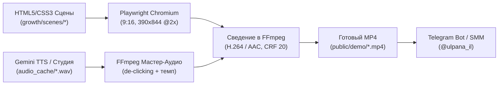

# Регламент видеопроизводства (Viral Video Production Playbook)

> **Статус:** 🔴 BLOCKING (Правило R-25 в `DECISION_MATRIX.md`)  
> **Назначение:** Единый стандарт создания, автоматической сборки и публикации вертикальных виральных видео (9:16, 15–30 секунд) для Reels, TikTok, Shorts и Telegram в проекте «Ульпан Алеф».  
> **Цель:** Исключить повторение технических, визуальных и акустических ошибок при создании новых рекламных роликов.

---

## 🏗️ 1. Архитектура видеоконвейера (Two-Engine Pipeline)

Маркетинговые видео собираются детерминированным программным конвейером без использования тяжелых ручных видеоредакторов:



1. **Контур изоляции (`R-23`):** Все исходники сцен (`growth/scenes/`), скрипты сборки (`growth/scripts/`) и аудиокэш (`public/demo/audio_cache/`) изолированы от ядра приложения (`src/`).
2. **Аудио-драйвер таймингов:** Сцена синхронизируется **от длительности аудиодорожек**, а не от фиксированных секунд в JS. Мастер-скрипт вычисляет точные таймкоды (`visualTimings`) и передает их в браузер через `window.startReelsTimeline(timings)`.

---

## 🛑 2. Главные грабли и правила (Top 5 Invariants)

### 📌 Инвариант 1. Абсолютное позиционирование сцен (No Relative Root)
- **Проблема:** Если на селекторе сцены (`#scene-ulpana`) оставить `position: relative`, в контейнере `390x844` с `overflow: hidden` блоки встают в нормальный поток документа друг за другом. Вторая и третья сцены выталкиваются на `y = 844px` и зритель видит **абсолютно пустой тёмный экран**.
- **Стандарт верстки:**
  ```css
  .scene {
    position: absolute;
    inset: 0;
    width: 100%;
    height: 100%;
    opacity: 0;
    pointer-events: none;
    visibility: hidden;
    transition: opacity 0.35s ease, transform 0.35s ease, visibility 0.35s;
    transform: scale(0.98);
  }

  .scene.active {
    opacity: 1;
    pointer-events: auto;
    visibility: visible;
    transform: scale(1);
  }
  ```
- **Запрещено:** Назначать `position: relative` на корневой блок сцены.

---

### 📌 Инвариант 2. Акустический монтаж, de-clicking и естественность речи
- **Паразитный звук «к» на конце:** Механический срез фразы на иврите (например, «אֲנִי כְּבָר») по приблизительному времени срезает начало следующего слова. Буква каф (`כּ`) начинается резким взрывным импульсом (RMS подскакивает с 9 до 1137), что звучит как резкий металлический щелчок.
  - **Решение:** Нарезка выполняется строго по RMS-анализу тишины (RMS < 30) с обязательным наложением **20–30ms косинусного фейда** (fade-out). Для запинок и паники («Э-э... а-а... ани...») используется **прямой синтез отдельной дорожки** через Gemini TTS с голосом персонажа.
- **Устранение щелчков на стыках сцен (De-clicking):** На всех аудиофрагментах в мастер-миксе обязательно применяется **15ms поднятое косинусное окно (raised cosine window)** на старте и конце сэмпла:
  ```js
  const fadeLen = Math.floor(sampleRate * 0.015);
  if (i < fadeLen) fade = 0.5 * (1 - Math.cos(Math.PI * i / fadeLen));
  else if (i > clipSamples - fadeLen) fade = 0.5 * (1 - Math.cos(Math.PI * (clipSamples - i) / fadeLen));
  ```
- **Темпо-контраст:**
  - Закадровый русский голос диктора ускоряется до **1.22x** (`atempo=1.22`) для удержания динамики Reels/TikTok.
  - Реплика паники / растерянности ученика замедляется до **0.72–0.80x** (`atempo=0.75`), чтобы передать эмоциональный ступор.

---

### 📌 Инвариант 3. Плотность экрана (Zero Empty Space)
- **Проблема:** Использование `margin: auto 0;` на центральных кнопках (например, микрофоне) расталкивает элементы к верхнему и нижнему краю экрана, создавая гигантскую «черную дыру» в центре кадра.
- **Стандарт компоновки:**
  - Никаких `margin: auto 0;` внутри вертикальных флекс-контейнеров сцены.
  - **Контекст виден сразу:** При переходе в сцену тренажера зритель обязан **с первой миллисекунды** видеть шапку приложения, бейдж звонка (`🛵 Wolt • 00:04 🟢`) и карточку реплики курьера.
  - По клику на микрофон последовательно активируются звуковая волна речи, всплывающий ответ ученика и пословная плашка точности 98%. Экран никогда не должен выглядеть брошенным или пустым.

---

### 📌 Инвариант 4. Координаты тач-курсора (Pixel-Perfect Clicks)
- **Проблема:** Указание координат тач-курсора «на глаз» приводит к тому, что виртуальный палец кликает мимо кнопок (например, на 60px ниже микрофона).
- **Стандарт:** Координаты клика определяются по фактическому центру элемента через Playwright:
  ```js
  const box = await page.locator('#mic-btn').boundingBox();
  const centerX = Math.round(box.x + box.width / 2);
  const centerY = Math.round(box.y + box.height / 2);
  ```

---

### 📌 Инвариант 5. Юридический комплаенс и прохождение модерации
- **Органический контент (Telegram, Reels, TikTok, Shorts):**
  - Сравнительная реклама и сатира в Израиле законны (ст. 19 Закона об авторском праве 2007 г., прецедент *Burger King v. McDonald's*).
  - Разрешено противопоставление форматов («6 месяцев в Duolingo vs Реальность»).
- **Платный таргетинг (Meta Ads / TikTok Ads):**
  - Роботы-модераторы триггерятся на текстовое название зарегистрированного бренда (`Duolingo`) и отклоняют креатив за *Third-Party Trademark*.
  - **Правило для таргета:** Заменять прямое название бренда на узнаваемые сатирические тропы: **«6 МЕСЯЦЕВ С ЗЕЛЁНОЙ СОВОЙ 🦉»** или **«6 МЕСЯЦЕВ В ПРИЛОЖЕНИЯХ...»**.
- **Защита маскотов:** Использовать только системные Emoji (`🦉`, `🦆`). Категорически запрещено копировать оригинальные векторные/растровые файлы совы Duo.

---

## ✅ 3. Чек-лист проверки перед выгрузкой нового видео

Перед публикацией или показом пользователю нового ролика архитектор обязан:

| № | Пункт проверки | Как проверить | Статус |
|---|---|---|---|
| 1 | **Покадровый контроль сцен** | Сгенерировать скриншоты каждой активной сцены через Playwright и просмотреть через `view_file` | Обязательно |
| 2 | **Отсутствие пустых экранов** | Убедиться, что в центре кадра нет черных пустот и заголовок не перекрыт титрами | Обязательно |
| 3 | **Чистота аудиостыков** | Проверить отсутствие щелчков (de-clicking 15ms) и паразитных согласных на концах реплик | Обязательно |
| 4 | **Координаты тача** | Убедиться, что виртуальный палец попадает ровно в центр кнопки («Проверить», «Ответить», «Микрофон», «CTA») | Обязательно |
| 5 | **Хронометраж** | Длительность строго в диапазоне 15–30 секунд (идеал для удержания: 20–28 сек) | Обязательно |
| 6 | **Комплаенс כתיב מלא** | Все ивритские фразы в кадре проверены по Pealim SSOT (`R-04`..`R-06`) | Обязательно |
| 7 | **Intent Audit** | Физический запуск `npm run audit:intent` | Обязательно |
