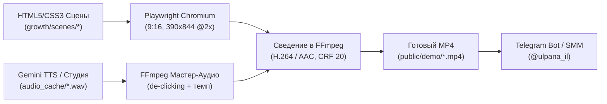

# Регламент видеопроизводства (Viral Video Production Playbook)

> **Статус:** 🔴 BLOCKING (Правило R-25 в `DECISION_MATRIX.md`)  
> **Назначение:** Единый стандарт создания, автоматической сборки и публикации вертикальных виральных видео (9:16, 15–30 секунд) для Reels, TikTok, Shorts и Telegram в проекте «Ульпан Алеф».  
> **Цель:** Исключить повторение технических, визуальных и акустических ошибок при создании новых рекламных роликов.

---

## 🏗️ 1. Архитектура видеоконвейера (Two-Engine Pipeline)

Маркетинговые видео собираются детерминированным программным конвейером без использования тяжелых ручных видеоредакторов:


```mermaid
flowchart LR
    A["HTML5/CSS3 Сцены<br/>(growth/scenes/*)"] --> B["Playwright Chromium<br/>(9:16, 390x844 @2x)"]
    C["Gemini TTS / Студия<br/>(audio_cache/*.wav)"] --> D["FFmpeg Мастер-Аудио<br/>(de-clicking + темп)"]
    B --> E["Сведение в FFmpeg<br/>(H.264 / AAC, CRF 20)"]
    D --> E
    E --> F["Готовый MP4<br/>(public/demo/*.mp4)"]
    F --> G["Telegram Bot / SMM<br/>(@ulpana_il)"]
```

1. **Контур изоляции (`R-23`):** Все исходники сцен (`growth/scenes/`), скрипты сборки (`growth/scripts/`) и аудиокэш (`public/demo/audio_cache/`) изолированы от ядра приложения (`src/`).
2. **Аудио-драйвер таймингов:** Сцена синхронизируется **от длительности аудиодорожек**, а не от фиксированных секунд в JS. Мастер-скрипт вычисляет точные таймкоды (`visualTimings`) и передает их в браузер через `window.startReelsTimeline(timings)`.

---

## 🛑 2. Главные грабли и правила (Top 5 Invariants)

### 📌 Инвариант 1. Абсолютное позиционирование сцен (No Relative Root)
- **Проблема:** Если на селекторе сцены (`#scene-ulpana`) оставить `position: relative`, в контейнере `390x844` с `overflow: hidden` блоки встают в нормальный поток документа друг за другом. Вторая и третья сцены выталкиваются на `y = 844px` и зритель видит **абсолютно пустой тёмный экран**.
- **Стандарт верстки:**
  ```css
  .scene {
    position: absolute;
    inset: 0;
    width: 100%;
    height: 100%;
    opacity: 0;
    pointer-events: none;
    visibility: hidden;
    transition: opacity 0.35s ease, transform 0.35s ease, visibility 0.35s;
    transform: scale(0.98);
  }

  .scene.active {
    opacity: 1;
    pointer-events: auto;
    visibility: visible;
    transform: scale(1);
  }
  ```
- **Запрещено:** Назначать `position: relative` на корневой блок сцены.

---

### 📌 Инвариант 2. Акустический монтаж, de-clicking и естественность речи
- **Паразитный звук «к» на конце:** Механический срез фразы на иврите (например, «אֲנִי כְּבָר») по приблизительному времени срезает начало следующего слова. Буква каф (`כּ`) начинается резким взрывным импульсом (RMS подскакивает с 9 до 1137), что звучит как резкий металлический щелчок.
  - **Решение:** Нарезка выполняется строго по RMS-анализу тишины (RMS < 30) с обязательным наложением **20–30ms косинусного фейда** (fade-out). Для запинок и паники («Э-э... а-а... ани...») используется **прямой синтез отдельной дорожки** через Gemini TTS с голосом персонажа.
- **Устранение щелчков на стыках сцен (De-clicking):** На всех аудиофрагментах в мастер-миксе обязательно применяется **15ms поднятое косинусное окно (raised cosine window)** на старте и конце сэмпла:
  ```js
  const fadeLen = Math.floor(sampleRate * 0.015);
  if (i < fadeLen) fade = 0.5 * (1 - Math.cos(Math.PI * i / fadeLen));
  else if (i > clipSamples - fadeLen) fade = 0.5 * (1 - Math.cos(Math.PI * (clipSamples - i) / fadeLen));
  ```
- **Темпо-контраст:**
  - Закадровый русский голос диктора ускоряется до **1.22x** (`atempo=1.22`) для удержания динамики Reels/TikTok.
  - Реплика паники / растерянности ученика замедляется до **0.72–0.80x** (`atempo=0.75`), чтобы передать эмоциональный ступор.

---

### 📌 Инвариант 3. Плотность экрана (Zero Empty Space)
- **Проблема:** Использование `margin: auto 0;` на центральных кнопках (например, микрофоне) расталкивает элементы к верхнему и нижнему краю экрана, создавая гигантскую «черную дыру» в центре кадра.
- **Стандарт компоновки:**
  - Никаких `margin: auto 0;` внутри вертикальных флекс-контейнеров сцены.
  - **Контекст виден сразу:** При переходе в сцену тренажера зритель обязан **с первой миллисекунды** видеть шапку приложения, бейдж звонка (`🛵 Wolt • 00:04 🟢`) и карточку реплики курьера.
  - По клику на микрофон последовательно активируются звуковая волна речи, всплывающий ответ ученика и пословная плашка точности 98%. Экран никогда не должен выглядеть брошенным или пустым.

---

### 📌 Инвариант 4. Координаты тач-курсора (Pixel-Perfect Clicks)
- **Проблема:** Указание координат тач-курсора «на глаз» приводит к тому, что виртуальный палец кликает мимо кнопок (например, на 60px ниже микрофона).
- **Стандарт:** Координаты клика определяются по фактическому центру элемента через Playwright:
  ```js
  const box = await page.locator('#mic-btn').boundingBox();
  const centerX = Math.round(box.x + box.width / 2);
  const centerY = Math.round(box.y + box.height / 2);
  ```

---

### 📌 Инвариант 5. Юридический комплаенс и прохождение модерации
- **Органический контент (Telegram, Reels, TikTok, Shorts):**
  - Сравнительная реклама и сатира в Израиле законны (ст. 19 Закона об авторском праве 2007 г., прецедент *Burger King v. McDonald's*).
  - Разрешено противопоставление форматов («6 месяцев в Duolingo vs Реальность»).
- **Платный таргетинг (Meta Ads / TikTok Ads):**
  - Роботы-модераторы триггерятся на текстовое название зарегистрированного бренда (`Duolingo`) и отклоняют креатив за *Third-Party Trademark*.
  - **Правило для таргета:** Заменять прямое название бренда на узнаваемые сатирические тропы: **«6 МЕСЯЦЕВ С ЗЕЛЁНОЙ СОВОЙ 🦉»** или **«6 МЕСЯЦЕВ В ПРИЛОЖЕНИЯХ...»**.
- **Защита маскотов:** Использовать только системные Emoji (`🦉`, `🦆`). Категорически запрещено копировать оригинальные векторные/растровые файлы совы Duo.

---

### 📌 Инвариант 6. Строгое соблюдение единого фабричного шаблона («Фабрика-500») и реестра платформ
- **Суть требования:** Все видеоматериалы для 100 уроков курса (200 мастер-скриптов: Clean и Spicy, 500 платформенных рендеров) создаются **строго на базе единого фабричного шаблона**. Категорически запрещено создавать кустарные, изолированные HTML-моки «на коленке» (черные пустые экраны с 2–3 текстовыми плашками без интерфейса приложения).
- **Обязательные элементы каждого ролика (Бренд и UI «Ульпан Алеф»):**
  1. **Шапка приложения (Branded Header):**
     - Фирменный логотип-куб `א` с градиентом `#0284c7` $\rightarrow$ `#38bdf8`.
     - Название продукта: **«Ульпан Алеф»**.
     - Фирменный слоган платформы: **«Иврит без паники»**.
     - Номер и тема урока: бейдж вида `Урок 1 • Первые слова` / `Урок 7 • Аренда квартиры`.
  2. **Интерфейс тренажёра и вкладки этапов:**
     - Обязательно отображаются ключевые вкладки обучения: `Словарь` (Этап 2), `Диалог` (Этап 5), `Звонок` (Этап 6).
     - Зритель с первого кадра видит, что это **реальный высокотехнологичный продукт**, а не абстрактное слайд-шоу.
  3. **Плотность экрана (Zero Empty Space):**
     - Вертикальный контейнер строго `100vh` (на мобильном вьюпорте `390x844 @2x`).
     - Нижняя половина экрана **никогда не должна пустовать**: в ней размещается диалоговый тред / симулятор звонка, кнопка микрофона с пульсирующей анимацией звуковой волны, интерактивный тач-палец и плашка мгновенного подтверждения от ИИ (`✨ Точность 98% • Вас отлично поняли!`).
  4. **Канонический реестр промокодов по платформам (Strict Platform Registry):**
     - Код для **YouTube Shorts** — **СТРОГО `YT`** (запрещены любые варианты вроде `SHORTS`, `YOUTUBE` и т.д.).
     - Код для **Telegram** — **`TG`**.
     - Код для **Instagram Reels** — **`INSTA`**.
     - Код для **TikTok** — **`TIKTOK`**.
     - Код для **Facebook Reels** — **`FB`**.
     - Использование произвольных промокодов ломает сквозную маркетинговую аналитику воронки и строго запрещено.
  5. **Аудиостандарт закадрового голоса и реплик:**
     - Русский голос диктора / рассказчика: **Gemini TTS `Charon`** (одобрен и зафиксирован; фолбэк — мужской `ru-RU-DmitryNeural`). Запрещено использовать старый роботизированный женский Google Translate TTS.
     - Голоса иврита: мужской `he-IL-AvriNeural`, женский `he-IL-HilaNeural` или проверенные студийные записи Pealim SSOT.
     - Обязателен 15ms de-clicking (raised cosine fade) на старте и конце каждого аудиосэмпла.

---

### 📌 Инвариант 7. Стандарт «Живое фото» (Kinetic Living Photo) и кинематографичный B-Roll
- **Суть требования:** В видеоконтенте категорически запрещены «мертвые» статичные фотографии. Любое фото анимируется через кинематографичное непрерывное движение (Ken Burns effect).
- **Плавность движения (Zero Shake Policy):**
  - Запрещены искусственные фильтры резкой тряски камеры (`camera shake`, джиттер, псевдо-ручная съемка), вызывающие отторжение и визуальную грязь.
  - Движение обязано быть кино-стабильным: непрерывный медленный наезд зума (`scale=1.00 -> 1.08`), панорамирование по горизонтали или мягкий фокус на глазах/лице персонажа.
  - Для рендера в FFmpeg используется плавный шаг масштабирования:
    ```bash
    zoompan=z='min(zoom+0.0006,1.15)':d=125:x='iw/2-(iw/zoom/2)':y='ih/2-(ih/zoom/2)':s=1080x1920:fps=30
    ```

---

### 📌 Инвариант 8. Паттерн «Комедийный стоп-кадр» (Comedic Freeze-Frame Pattern)
- **Суть требования:** Для драматических и комедийных моментов (грубая языковая ошибка, шок от сленга, неожиданная реакция собеседника) вместо тряски камеры применяется классический комедийный прием «стоп-кадр с тишиной».
- **Четырехфазная структура паттерна:**
  1. **Фаза 1 (Звуковой триггер):** В момент произнесения шокирующей реплики звучит резкий скретч виниловой пластинки (`record_scratch.wav`), мгновенно обрывающий весь фоновый звук.
  2. **Фаза 2 (Мертвая пауза):** Полное замирание видеоряда (0 FPS motion freeze на 0.7–0.9 сек) и абсолютная гробовая тишина в аудиодорожке.
  3. **Фаза 3 (Комикс-оверлей):** Всплывающая плашка-реакция поверх замершего кадра (*«❓🤨❓ СТОП... ЧТО ОН СКАЗАЛ?!»*, *«💀 ОЙ... ТОЛЬКО НЕ ЭТО»*).
  4. **Фаза 4 (Разрядка):** Резкий звуковой акцент (визг шин, автомобильный клаксон, звон бьющейся посуды) $\rightarrow$ крупный план эмоциональной реакции персонажа $\rightarrow$ спокойный педагогический разбор от диктора.

---

### 📌 Инвариант 9. Библия персонажей и сквозной каст (Character Bible & Serial Casting)
- **Суть требования:** Запрещено генерировать случайные, одноразовые лица под каждый отдельный ролик. Видеофабрика работает по принципу **«Сериала Ульпана»** с постоянным пулом сквозных узнаваемых персонажей.
- **Единый реестр (`growth/characters/registry.json`):**
  - **Йоси (`yossi_taxi`):** Водитель такси в Тель-Авиве. Энергичный, громкий, сленг (*хабуб, капара, сабаба*). Голос: **Gemini TTS `Orus`** (баритон, 1.12x). Темы: пробки, дорога, Бен-Гурион, уличный сленг.
  - **Ноа (`noa_barista`):** Молодая бариста / студентка. Быстрая речь, кофе, аренда, молодежный сленг. Голос: **Gemini TTS `Aoede`** (1.15x).
  - **Шломо (`shlomo_market`):** Торговец на рынке Кармель. Колоритный, громкий торг, фрукты/овощи. Голос: **Gemini TTS `Fenrir`** (1.08x).
  - **Рина (`rina_official`):** Чиновница в Мисрад а-Пним / Банке. Строгий нормативный иврит, документы, очереди. Голос: **Gemini TTS `Aoede`** (строгий тембр, 0.96x).
  - **Диктор (`narrator`):** Голос бренда Ульпана. Спокойный наставник, правила и CTA. Голос: **Gemini TTS `Charon`** (1.18x).
- **Консистентность внешности и эмоций:**
  - Каждый персонаж имеет зафиксированный базовый промпт генерации и локальную библиотеку эмоций в `growth/characters/<id>/emotions/` (`neutral`, `shocked`, `explaining`).
  - Новые ролики собираются из проверенных ассетов персонажа, исключая галлюцинации и дрейф внешности.

---

### 📌 Инвариант 10. Технический регламент сборки в OpenChatCut (Fast Pipeline SLA)
- **Суть требования:** Исключить многочасовые простои конвейера при сборке роликов в NLE-движке OpenChatCut.
- **Правило Linked Import:** При импорте промежуточных B-Roll видео и графики в OpenChatCut (`import_local_media`) **СТРОГО использовать легкий режим `linked`** вместо тяжелого `managed`. Режим `managed` запускает генерацию contact sheets и прокси, замораживая очередь до 15–20 минут на один файл.
- **Принцип Audio-First:** Мастер-аудио со всеми звуковыми эффектами, стоп-паузами и точными таймкодами сводится и утверждается **ДО** создания таймлайна в редакторе, предотвращая каскадные пересчеты JSON-графа сцены.

---

### 📌 Инвариант 11. Мастер-конвейер фабрики с живыми фото и NLE-редактором (End-to-End Factory CLI)
- **Суть требования:** Производство каждого видеоролика курса полностью унифицировано и автоматизировано через мастер-скрипт фабрики:
  ```bash
  node growth/scripts/occ_factory.mjs --lesson <N> --spicy --all
  ```
- **Сквозная цепочка конвейера:**
  1. **Character Bible & Living Photos (`growth/characters/registry.json`):** Выборка канонического персонажа сцены (Йоси, Ноа, Шломо, Рина), генерация промптов для фотосессии эмоций, плавный кино-зум Ken Burns (`growth/scripts/create_dynamic_broll.mjs`) с нулевой тряской (Zero Shake).
  2. **Аудиомонтаж:** Gemini TTS (`Charon`, `Orus`, `Aoede`) + саунд-дизайн (SFX, стоп-кадр 0.86с, тишина).
  3. **Транспарентные карточки (`growth/scripts/generate_occ_overlays.mjs`):** 1080x1920 PNG с проверкой одушевленности (Animacy Check: `זָקֵן` vs `יָשָׁן`) и автоматической генерацией CTA-плашек для всех 5 платформ.
  4. **OpenChatCut NLE Orchestration:** Мгновенный linked-импорт ассетов, сборка проекта в редакторе (`http://127.0.0.1:3100/editor/<projectId>`) для визуального контроля и точной подгонки таймингов человеком.
  5. **Пакетный вывод для 5 платформ (`growth/scripts/render_occ_variants.mjs`):**
     - YouTube Shorts (`lesson_<N>_spicy_youtube_shorts.mp4`, промокод `YT`)
     - Telegram Channel (`lesson_<N>_spicy_telegram.mp4`, промокод `TG`)
     - Instagram Reels (`lesson_<N>_spicy_instagram_reels.mp4`, промокод `INSTA`)
     - TikTok (`lesson_<N>_spicy_tiktok.mp4`, промокод `TIKTOK`)
     - Facebook Reels (`lesson_<N>_spicy_facebook_reels.mp4`, промокод `FB`)
  6. **Реестры:** Автоматическая синхронизация `growth/data/publications.json` и `growth/lessons_video_registry.json`.

---

## ✅ 3. Чек-лист проверки перед выгрузкой нового видео

Перед публикацией или показом пользователю нового ролика архитектор обязан:

| № | Пункт проверки | Как проверить | Статус |
|---|---|---|---|
| 1 | **Покадровый контроль сцен** | Сгенерировать скриншоты каждой активной сцены через Playwright / OpenChatCut и просмотреть через `view_file` | Обязательно |
| 2 | **Отсутствие пустых экранов** | Убедиться, что в центре кадра нет черных пустот и заголовок не перекрыт титрами | Обязательно |
| 3 | **Чистота аудиостыков** | Проверить отсутствие щелчков (de-clicking 15ms) и паразитных согласных на концах реплик | Обязательно |
| 4 | **Координаты тача** | Убедиться, что виртуальный палец попадает ровно в центр кнопки («Проверить», «Ответить», «Микрофон», «CTA») | Обязательно |
| 5 | **Хронометраж** | Длительность строго в диапазоне 15–30 секунд (идеал для удержания: 20–28 сек) | Обязательно |
| 6 | **Комплаенс כתיב מלא** | Все ивритские фразы в кадре проверены по Pealim SSOT (`R-04`..`R-06`) | Обязательно |
| 7 | **Динамика «Живое фото» (Zero Shake)** | Отсутствие статичных фото; плавный кино-зум Ken Burns; полное отсутствие резкой тряски камеры | Обязательно |
| 8 | **Комедийный стоп-кадр** | Наличие скретча винила, паузы тишины 0.7–0.9с и комикс-плашки реакции перед разрядкой | Обязательно |
| 9 | **Персонаж из Реестра** | Персонаж взят из `growth/characters/registry.json`, закрепленный голос и внешность соблюдены | Обязательно |
| 10 | **Быстрый импорт (Linked Mode)** | В OpenChatCut использован легкий режим `linked` без генерации тяжелых раскадровок | Обязательно |
| 11 | **Фабричный шаблон** | Ролик собран строго по фабричному стандарту: шапка с логотипом `א`, слоган «Иврит без паники», вкладки «Словарь/Диалог/Звонок», Zero Empty Space | Обязательно |
| 12 | **Код платформы** | Промокод строго по реестру: **`YT`** для YouTube Shorts, `TG` для Telegram, `INSTA`, `TIKTOK`, `FB` | Обязательно |
| 13 | **Intent Audit** | Физический запуск `npm run audit:intent` (при изменении учебных данных) | По регламенту |
